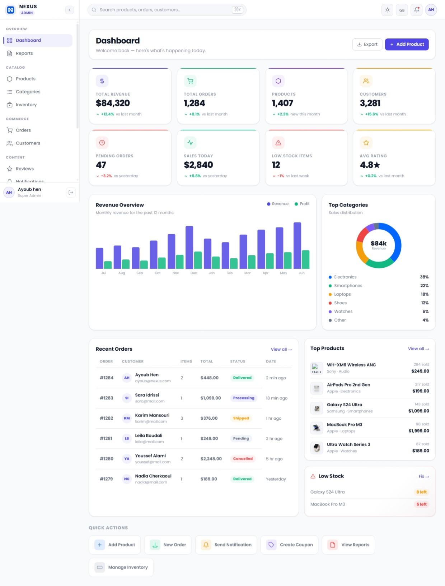

# Nexus Commerce

> A modern, responsive e-commerce platform with a full-featured admin dashboard — built with Angular 22, standalone components, and signals.


**Frontend:** ✅ Complete and actively developed &nbsp;•&nbsp; **Backend/API:** ⏳ Planned (not yet implemented — see [Backend Status](#-backend-status))

---

## 📸 Preview




---

## Overview

Nexus Commerce is a two-sided e-commerce application: a customer-facing **storefront** and a separate, dark-themed **admin dashboard** for managing the store. It's built to demonstrate how a real-world Angular admin/e-commerce system is structured — feature modules, lazy-loaded routing, signal-based state, a shared design-token system, and a UI layer that's already shaped to plug into a real backend.

The project is designed for anyone evaluating Angular front-end architecture: recruiters, clients, or developers looking for a reference implementation of an admin dashboard built entirely with modern Angular (standalone components + signals, no NgModules, no external UI kit).

At this stage, **all data is generated on the frontend** (mock data and simulated network delays) so every screen, interaction, and workflow can be explored end-to-end without a backend. The application has been structured so a real API can be dropped in later with minimal rework — see [Backend Status](#-backend-status).

---

## ✨ Main Features

### Storefront

- Product catalog with category browsing and product detail pages
- Search, filtering, and category-based navigation
- Shopping cart and wishlist/favorites page
- Sign in / sign up flow with a mock authentication service (session persisted via `sessionStorage`)
- Post-login action resumption — actions like "Buy Now" or "Add to Wishlist" started while logged out are queued and automatically resumed after sign-in
- Contact page
- Glassmorphism navbar with a notification panel and micro-animations (heartbeat on favorites, cart bounce, bell ring on new notifications)

### Admin Dashboard

**Dashboard Home**
- Key stat cards (revenue, orders, products, customers, pending orders, low-stock items, average rating)
- Revenue/orders trend chart and recent-activity feed, rendered from mock data

**Products**
- Product list with table view, search, filtering, and sorting
- Add Product and Edit Product forms, sharing a common `ProductFormService`
- An in-place Edit Product modal for quick edits from the list

**Categories**
- Category list, Add Category, and Edit Category forms
- Category detail view

**Inventory**
- Stock overview with low-stock indicators
- Add Inventory Item and Adjust Stock workflows
- Warehouse-aware stock tracking

**Orders**
- Order list and order-detail views for tracking order status

**Customers**
- Customer list and customer management views

**Reviews**
- Review list with a View Review modal and a Delete Review modal
- Review status handling

**Notifications**
- Push notification center with read/unread state, selection, bulk mark-as-read, and delete
- Notification detail modal and a header notification-icon dropdown

**Administrators**
- Admin user list with role assignment
- Add / Edit / View / Delete admin modals, including last-online status

**Activity Logs**
- Chronological activity feed with a detail view per log entry

**Reports**
- A dedicated Reports module covering sales, orders, products, customers, categories, and payment-method breakdowns
- Date-range filtering (today / 7d / 30d / 90d / custom) and status filtering
- Custom-built SVG bar and donut charts (no external charting library)

**Settings**
- A single interactive settings workspace covering nine sections: **General, Profile, Security, Store, Payments, Email, Notifications, Appearance, and System**
- Draft/saved state with dirty-tracking, inline validation, save/reset actions, and toast feedback
- All changes are held in signals and simulate a save (with a short artificial delay); nothing persists to a real backend yet

> Every admin workflow above (create, edit, delete, save) runs against in-memory mock data with a simulated network delay — there is no live backend behind these actions yet.

---

## 🌍 Internationalization

The app ships with full i18n support for **English, French, German, and Spanish**, powered by a custom `LanguageService` (no third-party i18n library).

- **Language resolution order:** a previously saved choice in `localStorage` → the browser's `navigator.language` (auto-detects `fr`/`de`/`es`) → English as the default fallback
- **Live switching:** changing the language updates the entire app instantly through signals — no page reload is required to re-render text
- **Translation files:** JSON dictionaries per language in `public/i18n/` (`en.json`, `fr.json`, `de.json`, `es.json`), loaded on demand via a `TranslationLoader`
- **Fallback safety:** English is always kept loaded in the background, so a missing key in another language falls back to English instead of showing a blank or raw key
- **Persistence:** the selected language is saved to `localStorage` and restored on the next visit
- **Locale-aware formatting:** dates, numbers, currency, and percentages are formatted via `Intl` APIs based on the active locale
- Applied consistently across both the storefront and the admin dashboard (e.g. the admin Settings → General section)

---

## 🎨 UI / UX

- Fully responsive layouts across the storefront and the admin dashboard
- Two distinct, purpose-built design systems: a light, glassmorphism-influenced storefront and a dark, near-black admin interface
- Consistent shared UI patterns across admin modules: data tables with sticky headers, action menus that flip upward for the last rows in a list, search/filter toolbars, and card-based layouts
- Modal/dialog system (view, add, edit, delete flows) with escape-to-close, backdrop-click-to-close, body-scroll locking, and closing animations
- Toast notifications for user actions (save, delete, errors, etc.)
- Skeleton loading states (shimmer effect) while mock data "loads"
- Empty states for lists with no data
- Custom SVG-based charts and icons — no external UI or charting library

---

## 🛠️ Technology Stack

| Technology | Purpose |
| --- | --- |
| Angular 22 | Frontend framework (standalone components, signals) |
| TypeScript 6 | Application language, strict compiler options enabled |
| SCSS | Styling, with a shared design-token system |
| RxJS | Reactive utilities (e.g. translation loading) |
| Vitest | Unit testing |
| Angular Router | Client-side routing, including lazy-loaded feature routes and route guards |
| Angular Forms | Primarily template-driven forms (`FormsModule`); a few forms use `ReactiveFormsModule` |

**Angular concepts used throughout the codebase:**
- Standalone components (no `NgModule`s)
- Signals and `computed()` for state and derived values
- `@if` / `@for` control-flow syntax
- Services for shared state and business logic (`LanguageService`, `Auth`, `AdminAuthService`, `ProductFormService`, etc.)
- Route guards (`adminAuthGuard`, `adminLoginGuard`, storefront `authGuard`)
- Lazy-loaded routes via `loadComponent` / `loadChildren`
- A custom translation pipe (`TranslatePipe`)
- `HostListener` for keyboard (Escape) and outside-click interactions

---

## 🏗️ Project Architecture

```text
src/
├── app/
│   ├── admin/                  # Admin dashboard (lazy-loaded)
│   │   ├── components/         # Feature components: products, orders, customers,
│   │   │                       # inventory, reviews, notifications, admins,
│   │   │                       # activity-logs, reports, settings, admin-login, etc.
│   │   ├── model/               # Data models + several modal components
│   │   │                       # (add/edit/view/delete-admin, review, product modals)
│   │   ├── services/            # AdminAuthService, ProductFormService
│   │   ├── guard/                # Admin route guards
│   │   └── admin.routes.ts      # Lazy-loaded admin route tree
│   ├── auth/                    # Storefront auth: mock Auth service, action queue, guard
│   ├── components/               # Storefront feature components: home, products,
│   │                             # product-details, categories, cart, favorites,
│   │                             # navbar, footer, notification, contact,
│   │                             # sign-in, sign-up, auth-modal
│   ├── localization/            # LanguageService, translation pipe/loader, models
│   ├── model/                    # Shared (storefront-level) models
│   ├── services/                 # Shared (storefront-level) services
│   ├── app.routes.ts             # Top-level route table
│   └── app.config.ts
├── public/
│   ├── i18n/                     # en.json, fr.json, de.json, es.json
│   ├── icons/, products/, categories/   # Static image assets
└── styles.scss                    # Global styles
```

---

## 📦 Installation

**Prerequisites**

- Node.js (a recent LTS release is recommended)
- npm 11 (this project was built with `npm@11.17.0`)
- Angular CLI 22 (installed as a dev dependency; the local `ng` works without a global install)

### Clone with Git

```bash
git clone https://github.com/Ay-hen/nexus-commerce.git
cd nexus-commerce
npm install
```

### Download ZIP

Alternatively, on GitHub go to **Code → Download ZIP**, extract it, then run `npm install` from inside the extracted folder.

---

## 🚀 Running the Project

```bash
npm start
```

This runs `ng serve`. Once it's running, open:

```text
http://localhost:4200/
```

The app will automatically reload whenever you modify a source file.

**Other available scripts:**

```bash
npm run build   # Production build, output to dist/
npm run watch   # Development build in watch mode
npm test        # Run unit tests with Vitest
```

---

## ⚙️ Environment Configuration

There are currently no environment files or API base-URL configuration in this project. The current version does not require a backend environment configuration because the API layer has not yet been connected — every module runs on in-memory mock data generated at runtime.

---

## 🔌 Backend Status

The current version focuses on the Angular frontend and the admin experience. **Backend/API integration is planned as the next development phase.**

Storefront auth, admin auth, and the Settings save flow are all built around a mock layer (in-memory state, `sessionStorage`/`localStorage` persistence, and simulated network delays) that mirrors the shape of a real API call — each mutation point is written so it can be swapped for an HTTP call without changing the surrounding component logic.

Planned backend-powered areas (not yet implemented):

- Real authentication (JWT-based, replacing the current mock login/session)
- User/admin management persistence
- Product, category, and inventory persistence
- Orders and customers backed by a real database
- Reviews, notifications, and settings persistence
- Analytics/reports computed from real data
- Database integration

---

## 🗺️ Development Roadmap

### Completed
- [x] Storefront: catalog, product details, cart, favorites, contact, mock sign-in/sign-up
- [x] Admin dashboard shell with sidebar layout and route guards
- [x] Admin modules: Dashboard, Products, Categories, Inventory, Orders, Customers, Reviews, Notifications, Admins, Activity Logs, Reports, Settings
- [x] Full i18n system (English, French, German, Spanish) with live switching and persistence
- [x] Shared design-token system for storefront and admin themes
- [x] Unit test suite (Vitest) covering key storefront and auth logic

### In Progress
- [ ] Broadening automated test coverage into the admin dashboard modules

### Planned
- [ ] Backend API (Spring Boot)
- [ ] Database integration (MongoDB)
- [ ] Real authentication (JWT) for storefront and admin
- [ ] Persistent data for every currently mocked module
- [ ] CI/CD pipeline

---

## 🔮 Future Backend Architecture

The frontend has been structured so a real backend can be introduced without reshaping the UI layer. This is the **planned** direction — nothing below is implemented yet:

```text
Angular Frontend
       ↓
REST API
       ↓
Backend (Spring Boot)
       ↓
Database (MongoDB)
```

---

## 📷 Screenshots

Add screenshots as the project's visuals are finalized.

### Dashboard


### Products


### Orders


### Settings


---

## 📱 Responsive Design

The storefront and admin dashboard are both built with responsive layouts intended to adapt across desktop, tablet, and mobile viewports — including a mobile-friendly collapsible sidebar and mobile nav in the admin Settings module.

---

## ✅ Code Quality

- Standalone Angular components throughout — no `NgModule`s
- Signal-based state with `computed()` for derived values
- Strict TypeScript compiler options (strict template checks, `noImplicitReturns`, `noFallthroughCasesInSwitch`, `strictInjectionParameters`, `strictInputAccessModifiers`)
- Clear separation of concerns: components, services, models, and guards each live in their own folders
- Shared services for cross-cutting concerns (auth, language, product forms)
- SCSS organized around a shared design-token system per theme (storefront vs. admin)
- Reusable modal and form patterns applied consistently across admin modules
- Unit tests written with Vitest

---

## 🔭 Future Improvements

- Backend API and database integration
- Real authentication and authorization
- Persistent settings, products, orders, and customer data
- Real-time notifications
- Expanded automated test coverage and CI/CD

---

## 📄 License

License information will be added in a future release.

---

## 👤 Author

**Ayoub Brahim Hennani**

Project repository: [github.com/Ay-hen/nexus-commerce](https://github.com/Ay-hen/nexus-commerce)